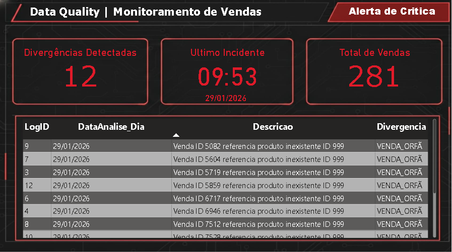

# 🛡️ O Guardião da Integridade (Data Quality Firewall)

> **Uma solução de Engenharia de Dados para detecção proativa de anomalias em transações de varejo.**

---

## 💼 O Cenário de Negócio (Business Case)

  

Em grandes varejistas com sistemas legados, falhas de concorrência (*race conditions*) podem gerar **"Vendas Fantasmas"** — pedidos confirmados sem a baixa correspondente no estoque.

Essas falhas silenciosas causam:
*   📉 **Furos de Estoque:** Divergência entre físico e sistêmico.
*   🚚 **Falhas Logísticas:** Venda de produtos indisponíveis.
*   💸 **Impacto Financeiro:** Erros contábeis detectados apenas no fechamento mensal.

**O Objetivo:** Criar uma barreira de integridade que audite transações e notifique anomalias antes que elas impactem o cliente ou o balanço.

---

## 💡 A Arquitetura da Solução

Implementei um padrão de **Auditoria Desacoplada** em três camadas estratégicas:

### 1. Camada de Dados (SQL Server - ELT)
O "motor" da validação. Em vez de transferir dados massivos pela rede, utilizamos o poder de processamento do banco.
*   **Stored Procedures ACID:** Auditoria transacional que garante consistência sem bloquear a operação.
*   **Log Estruturado (JSON):** As divergências são capturadas e armazenadas com todo o contexto técnico (payload da venda) em formato JSON, facilitando o debug para a equipe de TI sem sujar o modelo relacional.

### 2. Camada de Orquestração (Python)
O "vigilante" do sistema.
*   **Agente Leve:** Um script Python que atua apenas como orquestrador. Ele conecta de forma segura, dispara a auditoria e interpreta os metadados do resultado.
*   **Alertas Inteligentes:** O sistema decide autonomamente se deve acordar um humano (alerta crítico) ou apenas registrar o log de sucesso, reduzindo a fadiga de alertas.

### 3. Camada de Inteligência (Power BI)
A "visão do gestor".
*   Os logs técnicos são transformados em dashboards executivos através de Views SQL otimizadas, permitindo acompanhar a saúde do sistema e a frequência de erros em tempo real.

---

## 🚀 Como Executar
1 - Clone o repositório.

2 - Restaure o script setup_database.sql no seu SQL Server.

3 - Configure os dados de conexão no arquivo auditor_vendas.py.

4 - Execute python auditor_vendas.py.

---

*Projeto desenvolvido para portfólio de Engenharia de Dados.*
